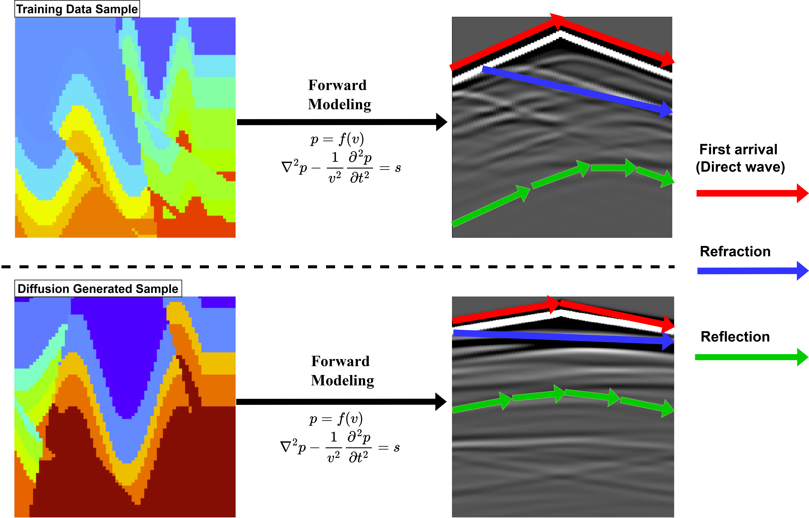

# Physical Field Generation via Diffusion Models

## 📑 Read Our Paper
Check out our research paper: [diffusion_for_science.pdf](diffusion_for_science.pdf)

## 🎮 Try It Yourself!
Generate your own Kolmogorov Flow in our interactive demo: [Kolmogorov Flow Generator](https://huggingface.co/spaces/SimingShan/Kolmogorov_Flow)

## 💾 Resources

### Datasets
- **Kolmogorov Flow Dataset**: [Download](https://drive.google.com/file/d/1CUHSF9pUtsrEtHKd07dFuplK7RtVx6ck/view?usp=drive_link)
- **Velocity Map Dataset**: [OpenFWI Project](https://sites.google.com/site/youzuolin044/openfwi)

### Pre-trained Models
- **Kolmogorov Flow Model**: [Download Weights](https://drive.google.com/file/d/1RRQN71KGJS-pruVhf2kDv0e4Z8Z3ow46/view?usp=sharing)
- **Velocity Map Model**: [Download Weights](https://drive.google.com/file/d/1n4Alx2foT0oJ5Ve-wxuBO31-3sLzw508/view?usp=sharing)

## ⚙️ Implementation Guide

### Training
- For Kolmogorov flow: `train/train_flow.py`
- For velocity maps: `train/train_velocity_map.py`

### Sampling
Generate synthetic data using:
- Kolmogorov flow: `sample/sample_kf.py`
- Velocity maps: `sample/sample_vm.py`

### Analysis Tools

#### Kolmogorov Flow Analysis
- Kinetic spectrum: `evaluation/kinetic.py`
- Mass conservation: `evaluation/velocity_plot.py`

#### Velocity Map Analysis
- Seismic conversion: `evaluation/seismic_vis.py`

## 📊 Results Gallery

### Fluid Mechanics: Kolmogorov Flow

#### Diffusion Process

   

*Progressive denoising: From random noise to coherent flow patterns*

#### Flow Field Generation

   

*Complex flow structures and pattern formations*

#### Flow Analysis

   

*Velocity field spatial distribution patterns*

#### Physical Validation

   

*Energy distribution spectral analysis*

### Geophysics: Velocity Maps

#### Generated Samples

   

*Diverse subsurface velocity distributions*

#### Forward Prediction

   

*Subsurface structure predictions*

## 📫 Contact
Having trouble reproducing the results? Contact: siming.shan.gr@dartmouth.edu